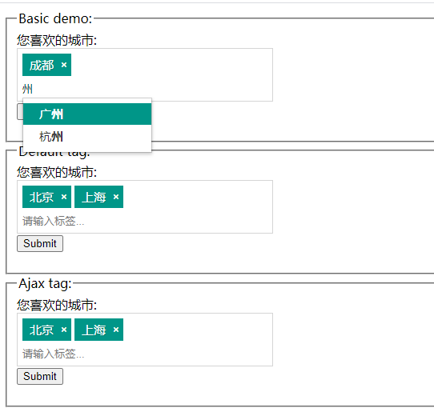

# jquery-tag
简单易用的jquery tag plugin.

源代码来twitter的 [typeahead.js](http://twitter.github.com/bootstrap/javascript.html#typeahead) 和 [bootstrap-tag.js](https://github.com/fdeschenes/bootstrap-tag) ，做了部分改动，添加一些示例。

## 特点

1. 基于jquery，简单易用，可自定义css样式
2. 支持模糊匹配，支持静态数据和Ajax动态查询数据

## 使用

1、确保系统中引入了jquery

2、引入css：
```html
<link rel="stylesheet" href="assets/css/default.css"/>
```

3、引入如下js：
```javascript
<script src="assets/js/typeahead.js"></script>
<script src="assets/js/jquery-tag.js"></script>
```

4、使用：

(1) 添加`input`：
```html
 <input type="text" name="tags" id="tag1" placeholder="请输入标签..."/>
```

(2) 静态数据
```javascript
var $tag1 = $('#tag1');
$tag1.tag({
    placeholder: $tag1.attr('placeholder'),
    source: ["北京", "上海", "深圳", "广州", "杭州", "成都", "other"]
});
```

(3) Ajax数据
```javascript
var $tag3 = $('#tag3');
$tag3.tag({
    placeholder: $tag1.attr('placeholder'),
    source: function (v, f) {
        console.log(v);
        console.log(f);
        let data = [];
        // query data from URL
        $.ajax({
            url: 'demo.json',
            data: {},
            type: 'get',
            async: false,
            success: function (d) {
                data = d;
            }
        });
        return data;
    }
});
```

(4) 获取输入的`tag`：

直接使用`$dom.val()`即可获取输入的所有标签：
```javascript
$('.input-tag').val()
```

## API
调用方法：
```javascript
$('.input-tag').tag(options);
```
### 配置选项(Options)

- `caseInsensitive` (可选)： 搜索匹配是否不区分大小写，默认为`true`，表示不区分大小写.
- `allowDuplicates` (可选)： 是否允许重复的标签，默认为`false`，表示不允许重复，即输入重复的标签无效.
- `source` (可选)： 搜索匹配的数据源，可以是一个数组(静态数据)或一个函数，默认为`[]`.
    - 数组：搜索是直接从该数组中查询并模糊匹配数据
    - 函数(function)：包含两个参数：
        1. `query`: 查询字符串，即已经输入的字符串，用来做模糊匹配
        1. `process`: 搜索处理函数，该函数会在`source`返回的结果数组中模糊匹配`query`(输入的字符串)

### 事件

事件绑定到jquery对象上，包含以下事件：
- `added`:  当一个标签被成功添加时立即出发改事件，额外参数为添加的标签.
- `removed`:  当标签被删除时立即触发该事件，额外参数为被移除的标签.

举例：
```javascript
$tag4.on('added', function (e, tag) {
    alert(tag + " 被成功添加！");
});
```
## Demo

更多示例参见`demo.html`，示例如下：

